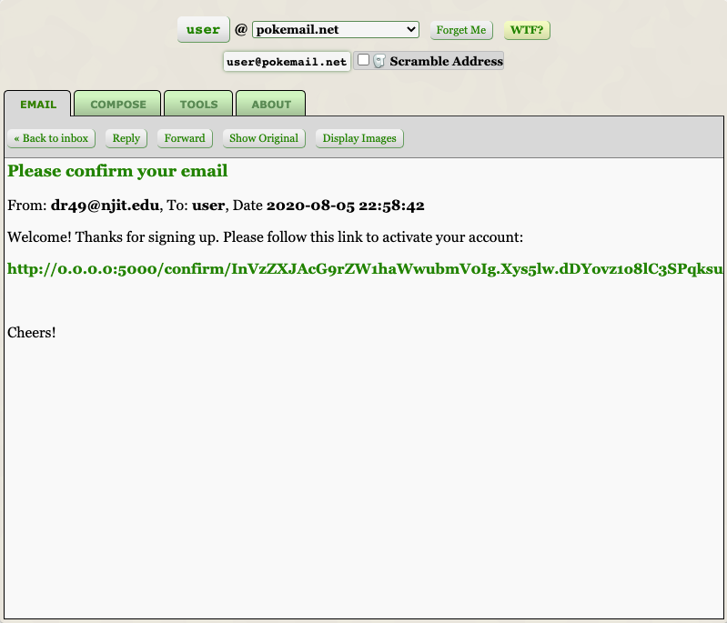
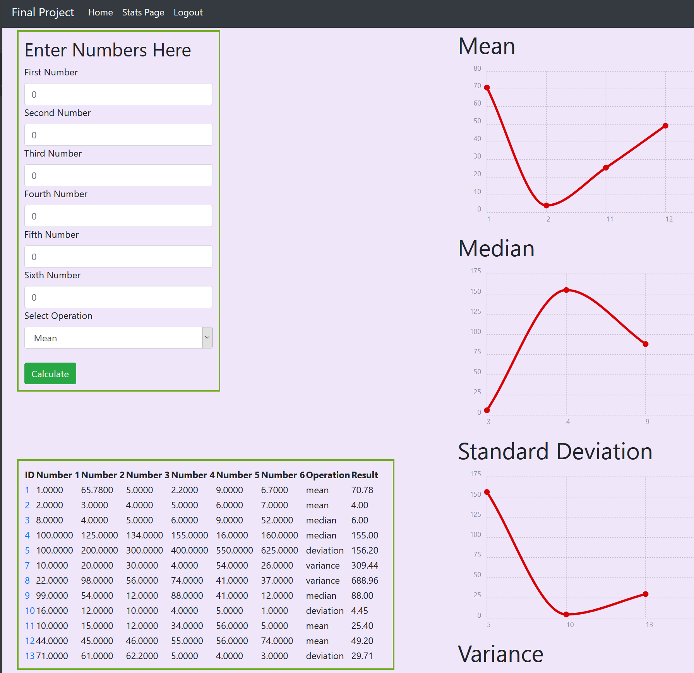

#  Final Project - Stats Web App

### Team:
##### Douglas Rizio 
Features worked on - Flask, login and verification, email verifications, general fix-ups

##### Michael Rock - 
Features worked on - Templates, charts, calculator and stats functions, general layout  

### Installation
The app can be cloned from the git repository and started with a simple docker-compose up command.

### Description
The app will utilize sgin-in/ sign-up functions as well as perform some arithmetic and stats functions while charting the output
using the Chartist.js, and Flask libraries. Our app also utilizes Docker, Python, and a database. 

### Usage 

#### Log-in
Upon first loading our app, the user is greeted with the log-in/registration screen. 

 

#### Sign-Up
If this is the first time using our app the user will need to follow the prompts to register, where they can enter their email address, username, and password.

 

#### Email Confirmation Required
After signing up for an account, the user is greeted with a new page prompting to check their email for a confirmation link.

 

The user may then attempt to log into the application, or resend the confirmation email.

However, if the user tries to log in without being confirmed, they will be redirected back to this page.

#### Server Email
On the server side (through SendGrid), the confirmation email is sent to the user.

 

More server-side details about the confirmation email:

#### User Email
The user then receives the confirmation email in their inbox (example: Guerrilla Mail, a temporary email address creator).

The email contains a confirmation link that, when clicked, allows the user to activate their account.

#### Confirmed Account
Upon clicking the email link, the user is then redirected to a page with an account confirmation message and a link to the login page.

### Login (after confirmation)
Now, the user can login!

#### Calculation Screen
After logging in, the user is greeted by the calculation screen (and is also able to log out through the navigation above):  

 

The left column displays the number entry and database table of all entries. The calculations can be performed on any two numbers.
For operations that require only one number (square, square root) please enter a zero in the second box. 

The right column displays the totals along with a trend line of all entries. These utilize the chartist.js charting library. Clicking on the id number of an equation will bring the user to the individual calculation scrren. The user then has an option to delete equation from the database. 

 

#### Stats Page
At the top of the page you will find a link to the stats page. 

The stats page follows the same layout ast the calculation screen. Including viewing individual calculations and deletion procedures. However, more data is required for the functions to run. In order to use the stats functions six numbers **MUST** be entered. The stats screen tracks the individual totals of each function. 

 
#### Postman
Data can actually be read and written to our app using API's and json. To use post man only the numbers and operation for the calculations or statistics need to entered. 

   

Deletions can also be completed by supplying the id number as part of the request. 

